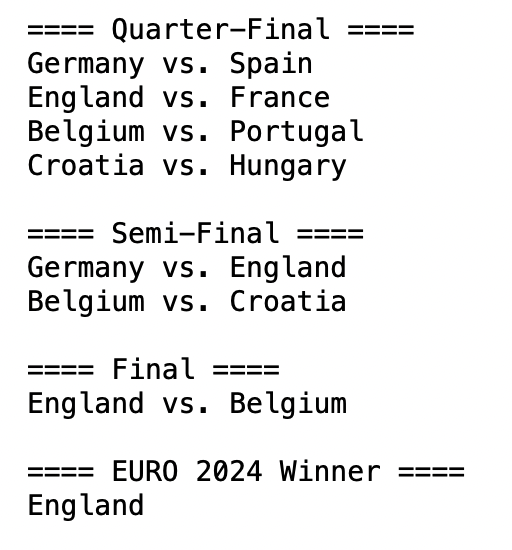
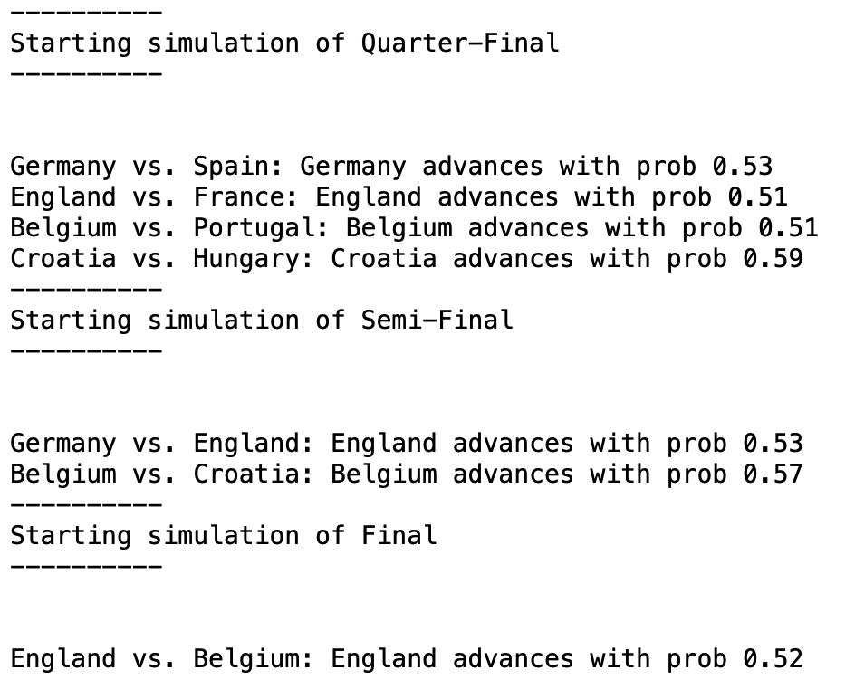
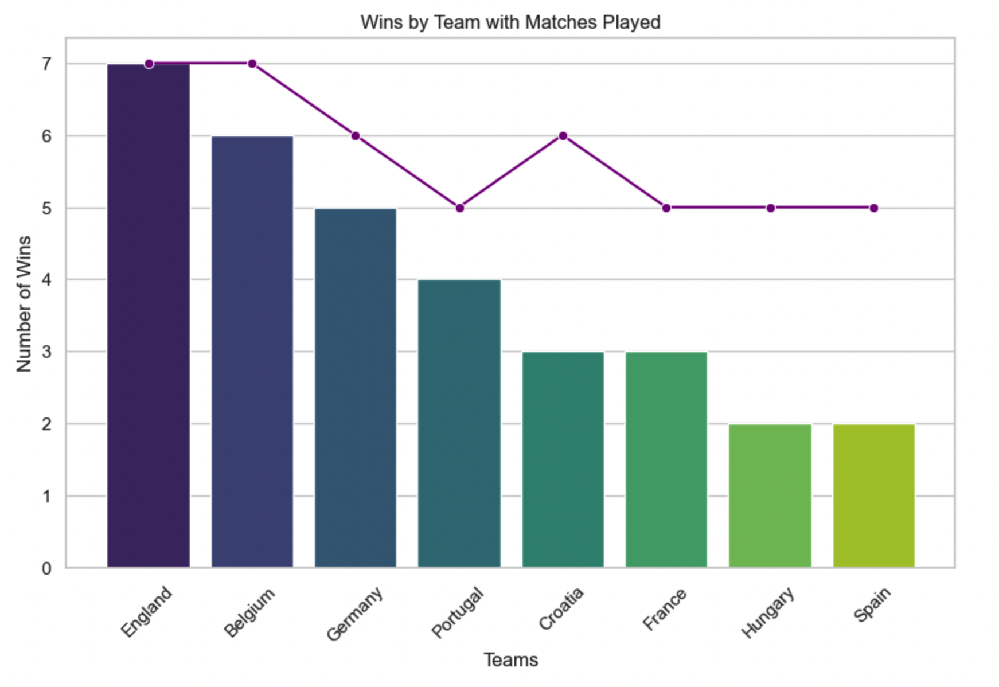

# EURO_2024_Prediction_

## Overview
This project uses Gradient Boosting (GB) and Random Forest (RF) models for predicting the EURO 2024 outcomes. The data used in this project includes match data collected from 2019-01-01 to 2024-03-26.

## Quarter-Final, Semi-Final, Final-Prediction

## Top 8 Teams by Wins

The image above shows the top 8 teams in terms of wins based on the collected match data.

## Disclaimer
Football is known for its unpredictability. This prediction model is developed purely for entertainment purposes and should not be used for betting or any serious decision-making.

